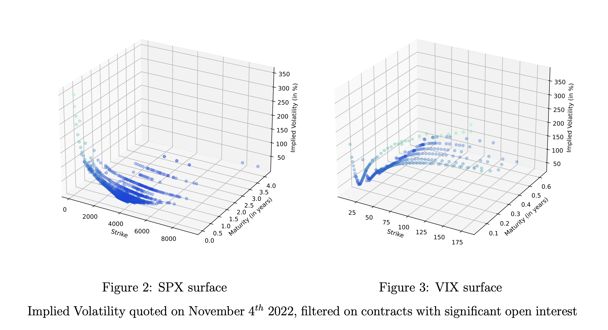

# Joint calibration of SPX and VIX smiles

We are investigating the performance of a new class of stochastic volatility models for fitting SPX and VIX smiles. In particular, we put the emphasis on rough volatility and how to reconcile such dynamics with classic Markovian models.



## Structure of the code

There are two big machineries in the code: the models that usually have a method to generate sample paths, and the stylized facts on which we evaluate the generated prices.

```
❯ tree
.
├── __init__.py
├── config.py
├── models
│   ├── __init__.py
│   ├── base_model.py
│   ├── fbm.py
│   ├── heston.py
│   ├── kernels.py
│   ├── qHeston.py
│   ├── quintic_ou.py
│   ├── rBergomi.py
│   ├── rHeston.py
│   ├── sabr.py
│   └── test.py
├── stylized_facts.py
└── utils.py
```